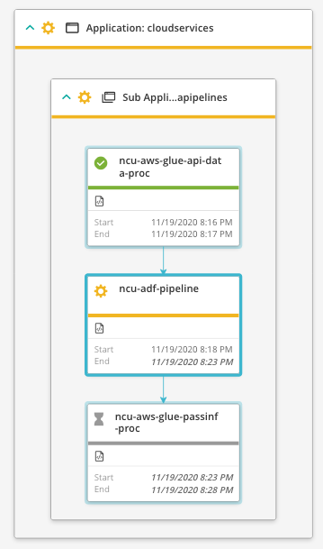
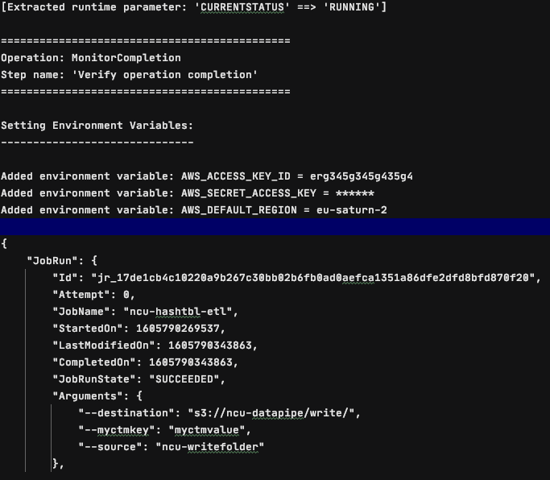

# Control-M AWS Glue plugin
Version 9.15

### Go directly to the Quick Start Guide
https://pmbmc.github.io/awsgluedocs/#/quickstart

### Short description:
Control-M Integration plugin for AWS Glue.

Created on 01-Nov-2020
Updated on 18-Nov-2020
 
### Detailed description:

The AWS Glue plugin for Control-M enables the integration of AWS Glue with the rest of your application 
ecosystem, allowing for a true hyper automated application stack. True enterprise orchestration enables continuous SLA and business
process management.

Hyper automation allows for orchestrating a multitude of steps across business processes. In the context of data pipelines
this means that a data source may be the start of a pipeline but it is not the starting point of a business process.
A number of steps would be performed prior to a data pipeline being triggered. Prior steps could be application based where the data 
source is generated as an output from the application. Automating the end to end process provides clear and decisive 
visibility and management of the entire ecosystem, bonding pipelines with supplying applications.

#### Features

* #### 1. Integrate an AWS Glue job with external components.  

    The below flow includes an Azure Data Factory Pipeline between 2 AWS Glue Jobs :

* #### 2. Monitor the pipeline status and Return the results of the glue jobs to the output in the Control-M Monitoring domain.  

* #### 3. Integrate AWS Glue job runs with all existing Control-M capabilities.  
    For example : 
                   
        a. Have your Glue trigger jobs defined in JSON and managed by your cicd process.          
        b. Attach SLA's to your pipeline.
        c. Wait for a file source to arrive, process it in an application and run a Glue Job based on the outcome.
        d. Attach prior and post dependancy steps to your pipeline for a fully encompassed view of your environment.
        e. A single reference point for the entire lifecycle of your data, from creation to analytics.

* #### 4. Avoid connection timeouts and unnecessary Glue job reruns

 
###### Troubleshooting guide
 
 https://pmbmc.github.io/ifdocs/#/awsglue_troubleshooting

 
