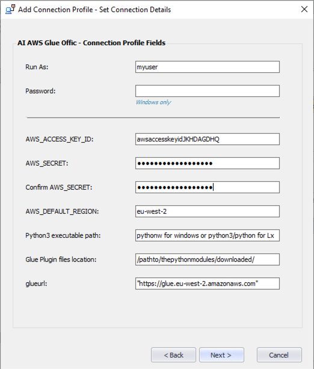

## Installation instructions 
Version 9.15

Created on 15-Nov-2020.
 
### Quick Start:
#### Control-M Integration to AWS Glue jobs.

This plugin is based on the AWS recommended sdk integration with AWS Glue.

https://docs.aws.amazon.com/glue/latest/dg/aws-glue-programming-python-calling.html
 
## Installation Details
### Prerequisites and installation notes:

    1.) Control-M Agent V9.0.20x or higher on a supported Linux or Windows environment with the Application Integrator CM V9.0.20x or higher
    2.) AWS access keys for programmatic access
    3.) Python 3.6 or higher

To set up aws programmatic access refer to this link

https://docs.aws.amazon.com/general/latest/gr/aws-sec-cred-types.html#access-keys-and-secret-access-keys

#### Python Libraries

This module uses the aws sdk for integration and therefore requires the python modules to handle to calls.

See the link below for guidance on installing the sdk and other libraries.

https://docs.python.org/3/installing/index.html

The libraries can be installed using pip install

    example: pip install boto3

Below is a list of the required python libraries in order for the modules to function correctly.

    boto3
    pandas
    ast
    sys
    json
    os
    time
 
#### 1. Download the AWS Glue job 
http://github.com/awsglueaijob

#### 2. Download the AWS Glue plugin modules

    gluejobctminput_env.py
    gluejobctmmonitor_env.py
    
Place the files in an accessible location on the host where the Control-M agent is installed and take note of the location

    example Windows: c:\ctmplugins\glueplugin\ 
    example Linux: /home/user/ctmplugins/glueplugin/

##### Watch an introduction video on Application Integrator
[AppIntVideo](https://youtu.be/7CshwZYMPWw)

#### 3. Deploy the plugin.
        a. Using the Application Integrator UI
        b. Using the Control-M Automation API  
    
         

        
           
#### 4. Define a connection profile

##### Connection Profile: Used for authenticating with AWS
    Add a new connection profile from the Configuration Manager.


    Input the required fields
    Note: The AWS secret key will be encrypted at entry.

### Linux Connection profile example



| Field | Value |
| --- | --- |
| AWS_ACCESS_KEY_ID | The access key your created on aws
| AWS_SECRET | The secret associated with your aws access key above |
| AWS_DEFAULT_REGION | The default region associated with your aws access key id |
| Python3 executable path | The path to your python executable |
|| Important NOTE: The python path for windows should point to the pythonw.exe|
|| For Windows: Pointing to the python.exe will result in failure of the modules to function due to the inability to work without an open execution window|
||Path handling : Remember to double quote paths if there are spaces as seen in the windows connection profile example below|
|Glue Plugin files location | The path to the location of the plugin modules that were downloaded|
|glueurl| The url to your AWS Glue environment, example: "https://glue.eu-west-2.amazonaws.com"|

### Windows Connection profile example


#### 5. Define an AWS Glue trigger job in Control-M

##### Job palette - Drag and drop your jobtype into a folder


##### Job Definition panel
 See the Job Parameter table below for details
 

    
    ===== Glue Trigger Job Parameters Description =====

| Field | Value |
| --- | --- |
| Connection Profile | The name of the predefined connection profile containing aws keys defined in the connection profile step 3 above
| Glue Job Name | The name of the Glue Job in AWS Glue that you wish to run. |
| Glue Job Arguments | Optional glue job arguments supplied in the below format |
| Arguments format | {'--Key1': 'value', '--Key2': 'value'} |
| |If there are no Job Arguments then leave the text field empty|
| Job Monitor Interval | The polling time in seconds that your job status should be verified

#### 6. You can also choose to build your Glue trigger job in Control-M Automation API using jobs-as-code

Control-M automation api allows for the creation of jobs in a JSON format.
Once you have deployed the AWS Glue plugin you have immediate support for the creation of AWS Glue jobs
in JSON format.

Sample JSON

```
{
  "glue_args": {
    "Type": "SimpleFolder",
    "ControlmServer": "production",
    "OrderMethod": "Manual",
    "AI AWS Glue Offic_Job_2": {
      "Type": "Job:ApplicationIntegrator:AI AWS Glue Offic",
      "ConnectionProfile": "NCUPRO",
      "AI-Glue Job Name": "ncu-hashtbl-etl",
      "AI-Glue Job Arguments": "{'--source': 'ncu-writefolder', '--destination': 's3://ncu-datapipe/write/'}",
      "SubApplication": "Glue",
      "Host": "appintagent",
      "CreatedBy": "emuser",
      "RunAs": "NCUPRO",
      "Application": "AWS"
    }
  }
}
``` 
    
#### 7. Run your first AWS Glue job from Control-M


#### 8. The Troubleshooting guide can be found at the following link
https://pmbmc.github.io/ifdocs/#/glue_troubleshooting

##### Performance:
Performance is dependant on your connectivity to AWS. Control-M jobs do not affect the performance of the AWS jobs
themselves. Control-M performs the triggering, monitoring and supplied completion status and information of the jobs.

Note:
    The current job type has been tested on Linux and Windows
 
 #### Return to AWS Glue plugin Introduction

https://pmbmc.github.io/awsgluedocs/

